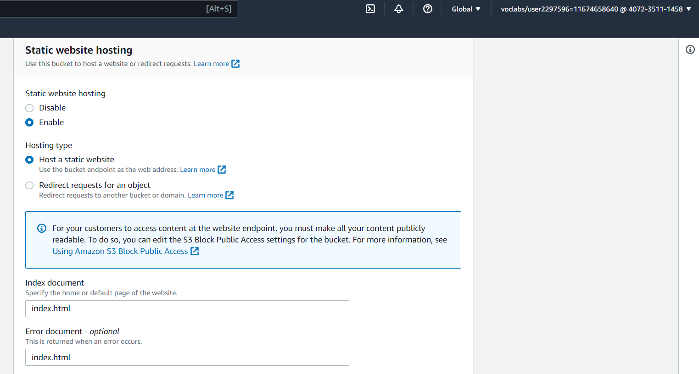

# Deploy a Static Website on S3 Bucket and Distribute using Cloudfront on AWS

## Project Overview
* Host a static website on S3 
* Access the cached website pages using CloudFront content delivery network (CDN) service. 

## Project Setup

Below is the overall process.  `Screenshots` can be accessed for a better understanding below:

- Create a S3 bucket
- Upload the website files to your bucket
- Configure the bucket for website hosting
- Secure the bucket using IAM policies
- Speed up content delivery using AWS Content Distribution Network service - CloudFront
- Access your website in a browser using the CloudFront endpoint

1. Create a bucket with a unique global name and Upload Objects into the s3 Bucket

2. Edit static website hosting and enable static website hosting. Also specify your index and error document

3. Edit the Bucket Policy and include an IAM Policy Configuration

4. Create a cloudfront distribution

5. Object URL and other endpoints created below  

#### URLs created in this project

- CloudFront distribution URL

- Bucket Website-endpoint 

- Object URL 
